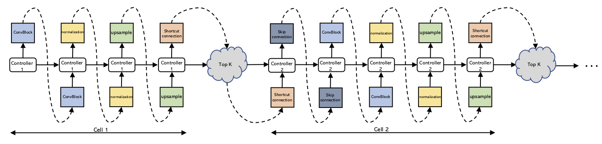
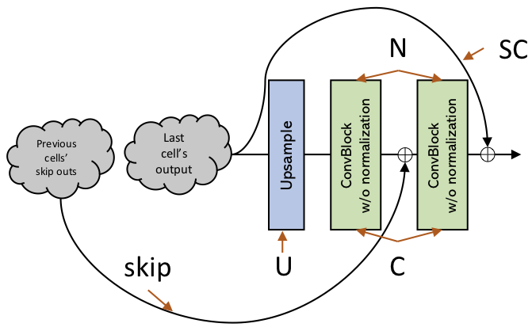
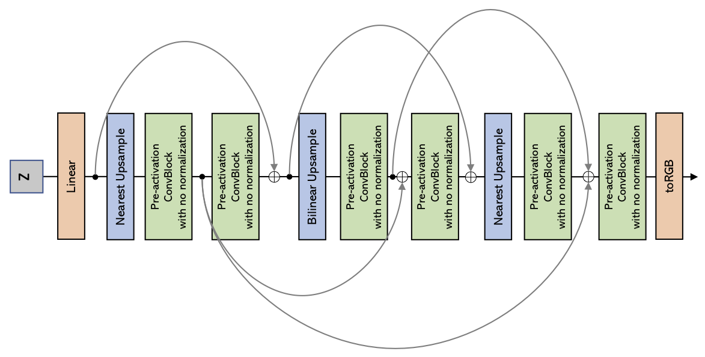
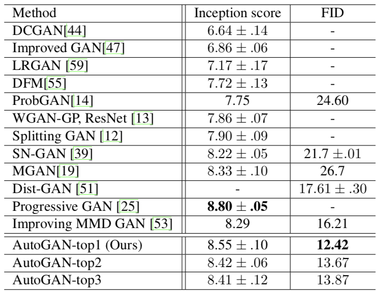
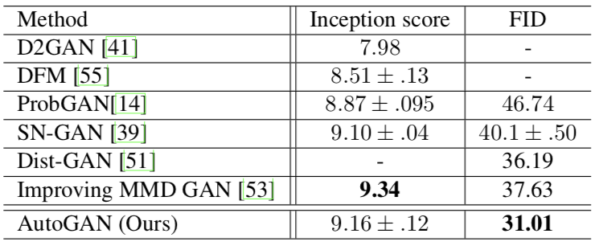

# AutoGAN: Neural Architecture Search for Generative Adversarial Networks
Code used for [AutoGAN: Neural Architecture Search for Generative Adversarial Networks](https://arxiv.org/abs/1908.03835). 

## Updates
* Oct-02-2019: Search code is released.

## Introduction
We've desinged a novel neural architecture search framework for generative adversarial networks (GANs), dubbed AutoGAN. Experiments validate the effectiveness of AutoGAN on the task of unconditional image generation. Specifically, our discovered architectures achieve highly competitive performance on unconditional image generation task of CIFAR-10, which obtains a record FID score of **12.42**, a competitive Inception score of **8.55**. 

**RNN controller:**
<p align="center">
  
</p>

**Search space:**
<p align="center">
  
</p>

**Discovered network architecture:**
<p align="center">
  
</p>

## Performance
Unconditional image generation on CIFAR-10.
<p align="center">
  
</p>

Unconditional image generation on STL-10.
<p align="center">
  
</p>

## Set-up

### environment requirements:
python >= 3.6

torch >= 1.1.0 

```bash
pip install -r requirements.txt
```

### prepare fid statistic file
 ```bash
mkdir fid_stat
 ```
Download the [pre-calculated statistics](http://bioinf.jku.at/research/ttur) to `./fid_stat`.


## How to search & train the derived architecture by yourself
```bash
sh exps/autogan_search.sh
```

When the search algorithm is done, you will get a vector denoting the discovered architecture, which can be viewed in the "*.log" file. 

To train from scratch and get the performance of your discovered architecture, run the following command (you should replace the architecture vector following "--arch" with yours):

```bash
python train_derived.py \
-gen_bs 128 \
-dis_bs 64 \
--dataset cifar10 \
--bottom_width 4 \
--img_size 32 \
--max_iter 50000 \
--gen_model shared_gan \
--dis_model shared_gan \
--latent_dim 128 \
--gf_dim 256 \
--df_dim 128 \
--g_spectral_norm False \
--d_spectral_norm True \
--g_lr 0.0002 \
--d_lr 0.0002 \
--beta1 0.0 \
--beta2 0.9 \
--init_type xavier_uniform \
--n_critic 5 \
--val_freq 20 \
--arch 1 0 1 1 1 0 0 1 1 1 0 1 0 3 \
--exp_name derive
```

## How to train & test the discovered architecture reported in the paper

### train
```bash
sh exps/autogan_cifar10_a.sh
```

### test
Run the following script:
```bash
python test.py \
--dataset cifar10 \
--img_size 32 \
--bottom_width 4 \
--gen_model autogan_cifar10_a \
--latent_dim 128 \
--gf_dim 256 \
--g_spectral_norm False \
--load_path /path/to/*.pth \
--exp_name test_autogan_cifar10_a
```
Pre-trained models are provided ([Google Drive](https://drive.google.com/drive/folders/1IYDNrKY3m97K3bx_uIzOL6vFmCjGNpYZ?usp=sharing)).

## Citation
If you find this work is useful to your research, please cite our paper:
```bibtex
@InProceedings{Gong_2019_ICCV,
author = {Gong, Xinyu and Chang, Shiyu and Jiang, Yifan and Wang, Zhangyang},
title = {AutoGAN: Neural Architecture Search for Generative Adversarial Networks},
booktitle = {The IEEE International Conference on Computer Vision (ICCV)},
month = {Oct},
year = {2019}
}
```

## Acknowledgement
1. Inception Score code from [OpenAI's Improved GAN](https://github.com/openai/improved-gan/tree/master/inception_score) (official).
2. FID code and CIFAR-10 statistics file from [https://github.com/bioinf-jku/TTUR](https://github.com/bioinf-jku/TTUR) (official).

